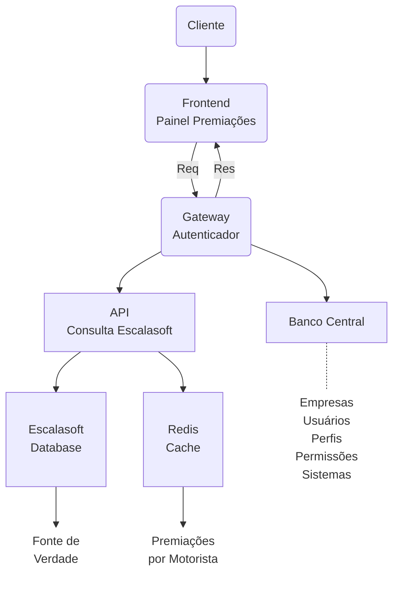

# Documentação do Painel de Premiações

## Visão Geral

- **Conexão entre Diferentes Camadas de Aplicações:**

```mermaid
flowchart TB
    A("Frontend<br>Painel Premiações") -- Req --> B("Gateway<br>Autenticador")
    B -- Res --> A
    B --> n1["Banco Central"] & n2["API<br>Consulta Escalasoft"]
    n2 --> n3["<br>Escalasoft<br>Database<br><br>"] & n4["<br>Redis<br>Cache<br><br>"]
    n1 -.- n5["Empresas<br>Usuários<br>Perfis<br>Permissões<br>Sistemas"]
    n6["Cliente"] --> A
    n4 --> n7["Premiações<br>por Motorista"]
    n3 --> n8["Fonte de<br>Verdade"]

    n5@{ shape: text}
    n6@{ shape: rounded}
    n7@{ shape: text}
    n8@{ shape: text}
```

- **Fluxo dos Dados**

```mermaid
flowchart TD
    %% Background Job Flow
    n1([BullMQ]) --> n2[Scheduler]
    n1 --> n3[Worker]
    n2 -- agenda --> n6[[Fila: premiacoes]]
    n6 -- processa --> n3

    n3 --> n5[atualizarCachePremiacoes]
    n5 -- executa --> n7[PremiacoesJob]
    n5 -- persiste --> n9[(Redis)]
    n7 -- query --> n17[(Database)]

    n3 -- eventos --> n12{ON}
    n12 --> n16[Logger]

    %% API Flow
    A(Frontend) -- GET --> n10[Controller]
    n10 --> n11[UseCase]
    n11 -- 1. cache --> n9
    n11 -- 2. fallback --> n7

    %% Shapes
    n7 --- n8[Organiza 6 SQLs paralelos]
    style n8 fill:none,stroke:none
    style n16 fill:none,stroke:none
```
