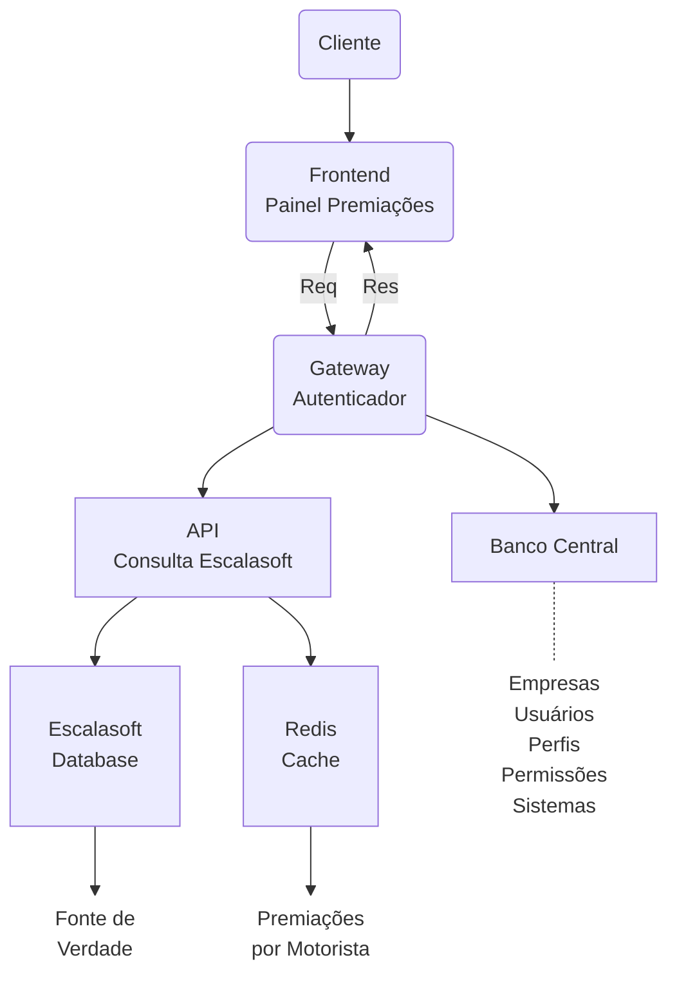
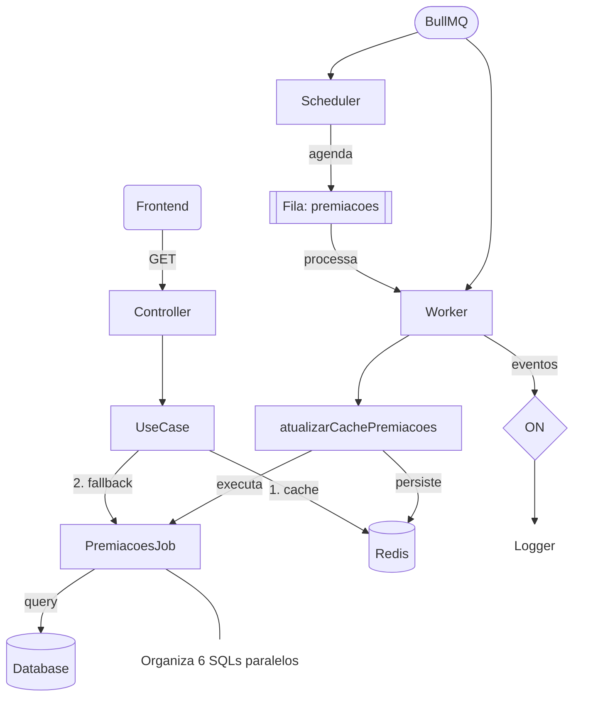
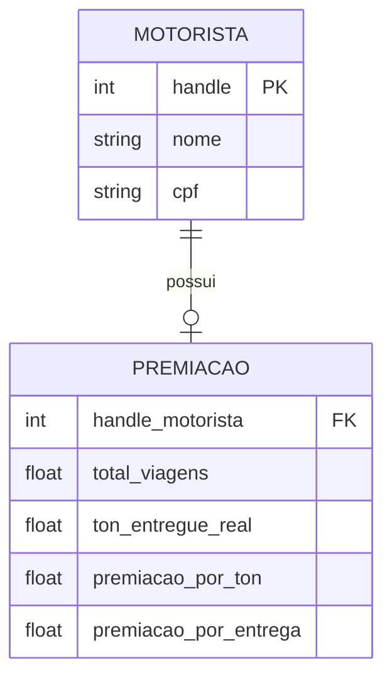

# API Dashboard Logístico - Painel de Premiações

## 📝 Visão Geral

Este projeto é uma API desenvolvida em **Node.js** com **Fastify** para gerenciar e exibir premiações de motoristas no Dashboard Logístico. O sistema consolida dados de múltiplas fontes via **MSSQL**, processa informações complexas de logística (viagens, romaneios, notas fiscais, devoluções) e disponibiliza esses dados de forma performática através de uma camada de **Cache com Redis** e processamento assíncrono com **BullMQ**.

## 🚀 Tecnologias Utilizadas

- **Framework:** [Fastify](https://www.fastify.io/)
- **Linguagem:** [TypeScript](https://www.typescriptlang.org/)
- **Processamento em Segundo Plano:** [BullMQ](https://docs.bullmq.io/)
- **Banco de Dados:** [MSSQL (SQL Server)](https://www.microsoft.com/en-us/sql-server)
- **Cache / Fila:** [Redis](https://redis.io/)
- **Validação:** [Zod](https://zod.dev/)
- **Testes:** [Vitest](https://vitest.dev/)
- **Logging:** [Winston](https://github.com/winstonjs/winston) (Custom Logger)

## 🏗️ Arquitetura do Sistema

O sistema segue princípios de Clean Architecture e SOLID, separando as preocupações em camadas de Domínio, Casos de Uso e Infraestrutura.

### Fluxo de Dados e Integração



### Processamento Assíncrono (Jobs)



## 📊 Modelagem

### Diagrama de Entidades (ER)



### Casos de Uso

```mermaid
usecaseDiagram
    actor "Frontend / Cliente" as client
    package "Módulo Motorista" {
        usecase "Listar Motoristas" as UC1
    }
    package "Módulo Premiações" {
        usecase "Listar Todas as Premiações" as UC2
        usecase "Consultar Detalhes por Motorista" as UC3
        usecase "Sincronizar Dados (Background Job)" as UC4
    }
    client --> UC1
    client --> UC2
    client --> UC3
    UC4 --> UC2 : atualiza cache
```

## 📁 Estrutura de Pastas

```bash
src/
├── app.ts                # Configuração do servidor Fastify
├── main.ts               # Ponto de entrada da aplicação
├── config/               # Configurações de DB, Env e Redis
├── infra/                # Implementações globais de infra (Cache, etc)
├── jobs/                 # Definição de Workers e Schedulers (BullMQ)
├── logger/               # Utilidades de Log
├── middlewares/          # Middlewares de segurança e validação
└── modules/              # Módulos de domínio da aplicação
    ├── motorista/        # Gestão de motoristas
    └── premiacoes/       # Gestão de cálculos e listagens de premiações
        ├── domain/       # Regras de negócio e entidades
        ├── dtos/         # Objetos de transferência de dados
        ├── infra/        # Repositórios e queries SQL
        ├── use-cases/    # Lógica de aplicação
        └── controller.ts # Handlers de rota
```

## 🛠️ Comandos

### Instalação

```bash
npm install
```

### Desenvolvimento

```bash
# Iniciar em modo de desenvolvimento
npm run dev

# Iniciar com hot-reload (watch mode)
npm run dev:w
```

### Testes

```bash
# Executar testes unitários e de integração
npm run test

# Executar testes com interface visual (Vitest UI)
npm run test:ui
```

### Produção

```bash
# Gerar build (TypeScript para JavaScript)
npm run build

# Iniciar servidor em produção
npm run start
```

## 🐋 Docker

O projeto inclui um `docker-compose.yml` para facilitar a subida de dependências como o Redis.

```bash
docker-compose up -d
```

---

Desenvolvido por **Gabriel Silvio**
